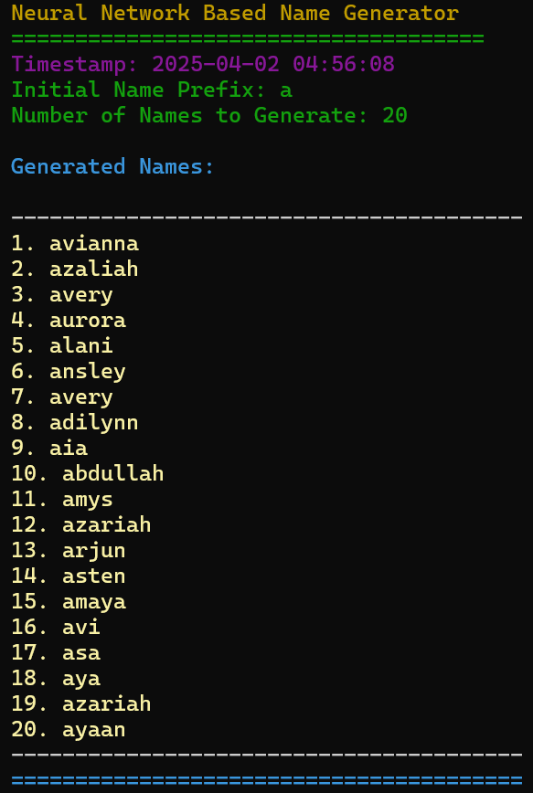
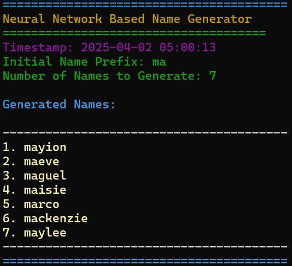
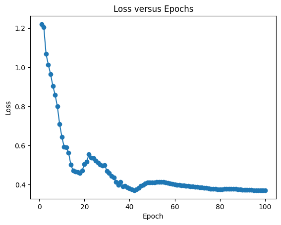

# Neural Network-Based Realistic Name Generator

## Project Description

<div>
This project uses a neural network-based approach to generate realistic names starting with a given prefix. The model was trained using an LSTM (Long Short-Term Memory) architecture, which learns character-level sequences and generates authentic names. The project includes functionality to generate realistic names based on the trained model.<br><br>

 

</div>

## Requirements

- Python 3.x
- PyTorch

> [!NOTE]
> <br>This project used the following packages during LSTM training: 
> - Numpy
> - Pandas
> - TensorFlow
> - Matplotlib

To install all required dependencies, run the following command:

pip install -r requirements.txt

## How to use the project

<table><tr><td>1. <ins>Clone the repository</ins></td></tr></table>
Clone this repository to your local machine:

```md
git clone <repository_url>
cd <repository_name>
```

<table><tr><td>2. <ins>Set up config in `settings.ini`</ins></td></tr></table>
Configure the settings by editing the `settings.ini` file. In the `config/` dir, you can set the following parameters:

- **namePrefix**: The starting character(s) for generating names (e.g., `a`, `ba`, `jo`).
- **genCount**: The number of names to generate.

Example of `settings.ini`:

[settings]  
namePrefix = a  
genCount = 20

<table><tr><td>3. <ins>Run `main.py`</ins></td></tr></table>

To generate names based on the prefix and count defined in the `settings.ini`, run the following in the terminal from the project directory:

```bash
python src/main.py
```

This will generate and display a list of names in the console.

## Sample Output

**<u>Console Output Example</u>:**


| `namePrefix`=a   `genCount`=20 | `namePrefix`=ma   `genCount`=7 |
|--------------------------------|------------------------------|
|  |  |


**<u>Loss vs Epoch Plot</u>:**

The following is  a plot for loss vs. epoch during model training. You can find the plot saved as `loss_vs_epoch.png` in the `output/` folder.


